---

## Objetivo

Se trata de una herramienta para USB basada en Linux Live (Kali Lite, la versión Live de Kali Linux) que permita realizar tareas clave de soporte técnico y análisis **en sitio** de manera rápida y eficiente, en nuestro caso vamos a utilizar herramientas ya existentes pero **automatizaremos el proceso mediante scripting con bash:

- Diagnóstico de hardware
- Recuperación de datos
- Análisis de seguridad y malware
- Escaneo básico de vulnerabilidades

Este proyecto está orientado a técnicos de soporte IT, helpdesk o administradores de sistemas que necesiten **agilizar y automatizar el proceso de diagnóstico y soporte a equipos in situ**.

---

## Componentes

### Hardware
- USB de al menos 8 GB (recomendado: 16+ GB si se desea persistencia)
- PC compatible con arranque USB

### Software necesario para crear el Live USB
- `Ventoy`, `Rufus`, `Etcher` o `dd`
- Imagen ISO personalizada

#### Creación del Live USB

1. Descargar una distribución Linux Live (ej. [Kali Linux Lite](https://www.kali.org/get-kali/#kali-live))
2. Usar **Rufus** o **Ventoy** para grabar la imagen en USB
3. Crear scripts personalizados con bash al sistema live (o usar persistencia)
4. (Opcional) Configurar arranque automático de scripts con `.bashrc`

### 1. Sistema Linux Live (Kali_Lite)

- Basado en una distribución ligera (recomendado: **Ubuntu LTS**, **Debian**, **Kali Lite**, o **Rescuezilla**)
- Personalizado para incluir herramientas de **diagnóstico y recuperación automatizadas**
- Compatible con BIOS y UEFI (compatibilidad con equipos modernos y antiguos)
- Soporte para arranque persistente live (opcional) para ejecutar desde USB sin instalación

### 2. Herramientas Preinstaladas

| Categoría                                    | Herramienta sugerida               | Descripción                                  |
| -------------------------------------------- | ---------------------------------- | -------------------------------------------- |
| Diagnóstico de hardware                      | `lshw`, `hwinfo`, `smartmontools`  | Verifica el estado del hardware              |
| Recuperación de datos y disco                | `TestDisk`, `PhotoRec`, `ddrescue` | Restauración de datos de discos dañados      |
| Análisis de malware y otras vulnerabilidades | `chkrootkit`, `rkhunter`, `clamav` | Detección básica de amenazas                 |
| Escaneo de red/vulnerabilidades              | `nmap`, `nikto`, `lynis`           | Auditoría rápida de dispositivos o servicios |

### 3. Scripts Automatizados con **bash

Ubicados en `/opt/scripts_diag` del sistema live.

- `hardware_check.sh`: resumen del estado de CPU, RAM, disco, etc.
- `data_recovery.sh`: ejecución guiada de herramientas como `PhotoRec`
- `malware-scan.sh`: escaneo básico del sistema montado
- `network-scan.sh`: escaneo de puertos y servicios en red

### 4. Cómo utilizar

1. Arrancar el sistema live desde USB
2. Dar permisos de ejecución a la carpeta de scripts
3. Ejecutar `hardware-check.sh` para revisar el estado general del equipo
4. Si hay problemas de disco, usar `data-recovery.sh` y seguir los pasos indicados de cada herramientas que fuera necesaria
5. Escanear el sistema en busca de malware y vulns con `malware-scan.sh`
6. Si el equipo está conectado a red, lanzar `network-audit.sh` (Puede tardar bastante, se recomienda ejecutarlo de forma paralela mientras realizas las otras comprobaciones)


---

## **Preparación del Entorno de Virtualización**

### Herramientas recomendadas:

- **VirtualBox**
- **VMware Workstation** (si lo tienes disponible)
- **GNOME Boxes** (en Linux)

### Crear una VM para pruebas:

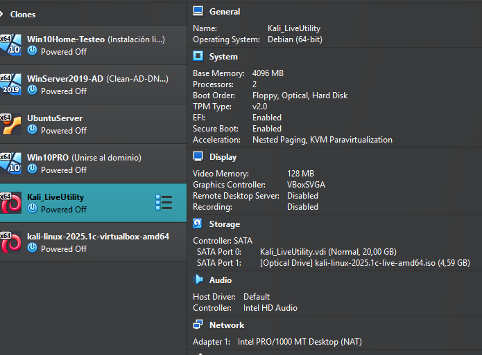


| Hardware         | Recomendado    |
| ---------------- | -------------- |
| RAM              | 2-4 GB         |
| Procesador       | 2 cores mínimo |
| Disco duro       | 20 GB dinámico |
| Modo de arranque | ISO            |
| Red              | NAT            |

- **Descarga una ISO base** (ej. Kali Linux Live)
  
    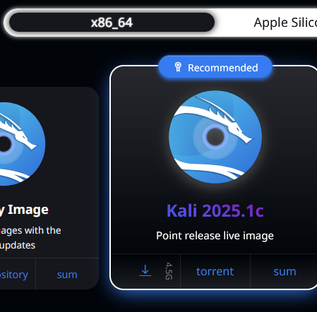
  
    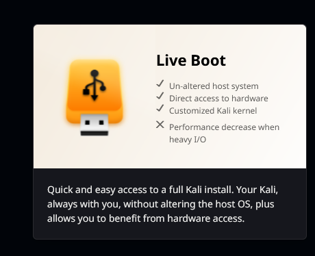
    

**Importante habilitar PAE/NX, esto es importante por temas de seguridad ya que muchas distribuciones Linux modernas la requieren para funcionar correctamente, además permite a distribuciones LIVE utilizar más memoria.**

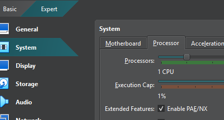

**Deshabilitar EFI, esto se debe a que muchas veces cambiar a modo BIOS suele resolver problemas de arranque de la ISO LIVE**

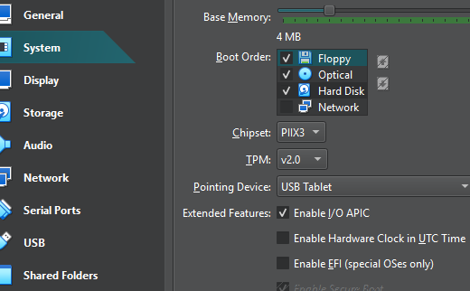

- **Cárgala como medio de arranque** en la VM.
    
- **Inicia el sistema Live** sin instalarlo
  
 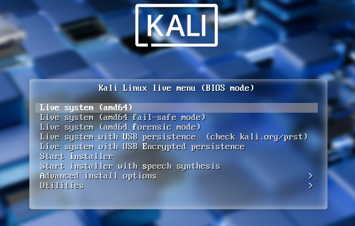

Una vez iniciado el sistema en modo Live:

### Instalar herramientas necesarias (temporalmente para pruebas)

- Antes de nada nos aseguramos de que nuestra distribución de teclado sea la correcta, en mi caso tenga un teclado español por lo que cambiaré la distribución de teclado para la sesión actual ya que estamos en una versión Live para testing

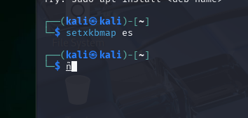

- Instalamos las herramientas que vamos a necesitar para realizar el diagnóstico del sistema:

```bash
sudo apt update && sudo apt install -y lshw hwinfo smartmontools testdisk photorec rkhunter chkrootkit clamav nmap nikto lynis
```


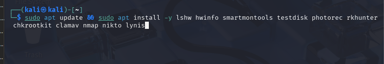

- **Solución:** Si nos encontramos el siguiente error es normal, se debe a que "testdisk" ya instala automáticamente "Photorec", cómo vemos podemos ejecutarlo.

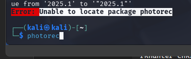

- Crearemos una carpeta dónde vamos a almacenar todos los scripts que iremos creando para realizar el diagnóstico

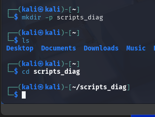

Están escritos para usarse en un entorno Linux Live y pueden ejecutarse directamente desde la terminal.

*Asegúrate de que los scripts tengan permisos de ejecución:*

```bash
chmod +x *.sh
```

- Creamos el primer script que nos realizará un breve chequeo del hardware del equipo:

```bash
sudo nano hardware_diag.sh
```

## `hardware-check.sh`

Diagnóstico rápido de hardware (CPU, RAM, disco, etc.).

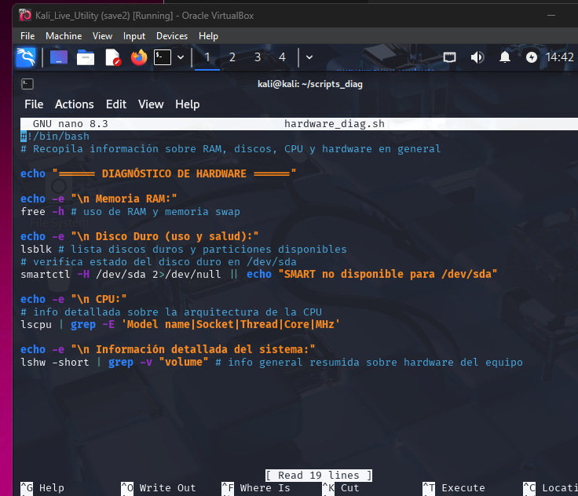

*Código del script de bash:*

```bash
#!/bin/bash
# Recopila información sobre RAM, discos, CPU y hardware en general

echo "====== DIAGNÓSTICO DE HARDWARE ======"

echo -e "\n Memoria RAM:"
free -h # uso de RAM y memoria SWAP

echo -e "\n Disco Duro (uso y estado):"
lsblk # lista discos duros y particiones disponibles
# verifica estado del disco duro en /dev/sda
smartctl -H /dev/sda 2>/dev/null || echo "SMART no disponible para /dev/sda"

echo -e "\n CPU:"
# info detallada sobre la arquitectura de la CPU
lscpu | grep -E 'Model name|Socket|Thread|Core|MHz'

echo -e "\n Información detallada del sistema:"
lshw -short | grep -v "volume" # info general resumida sobre hardware del equipo
```


## `data-recovery.sh`

Recuperación de datos con `testdisk` y `photorec`.

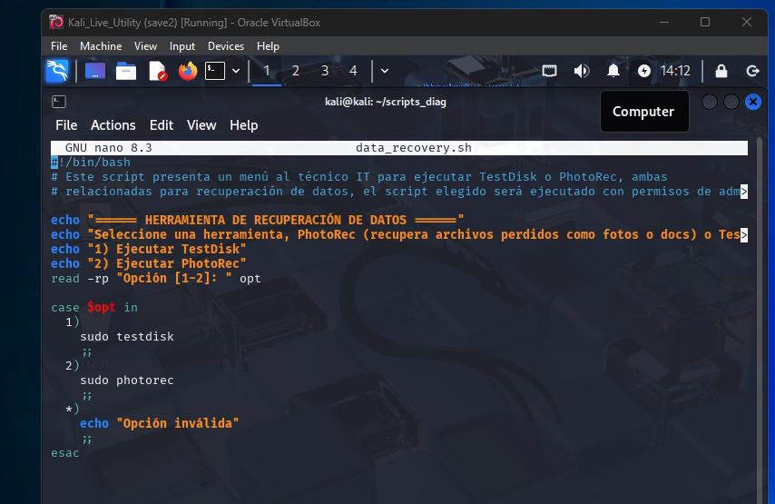

*Código del script de bash*

```bash
#!/bin/bash
# Este script presenta un menú al técnico IT para ejecutar TestDisk o PhotoRec, ambas relacionadas para recuperación de datos, el script elegido será ejecutado con permisos de admin

echo "====== HERRAMIENTA DE RECUPERACIÓN DE DATOS ======"
echo "Seleccione una herramientas, PhotoRec (recupera archivos perdidos como fotos o docs) o TestDisk (recupera particiones perdidas y hace que los discos vuelvan a arrancar):"
echo "1) Ejecutar TestDisk"
echo "2) Ejecutar PhotoRec"
read -rp "Opción [1-2]: " opt

case $opt in
  1)
    sudo testdisk
    ;;
  2)
    sudo photorec
    ;;
  *)
    echo "Opción inválida"
    ;;
esac

```

## `malware-scan.sh`

Análisis básico con ClamAV, chkrootkit y rkhunter.

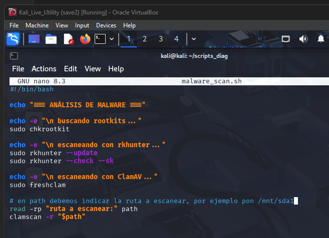

*Código del script de bash*

```bash
#!/bin/bash

echo "== ANÁLISIS DE MALWARE =="

echo -e "\n buscando rootkits..."
sudo chkrootkit

echo -e "\n escaneando con rkhunter..."
sudo rkhunter --update
sudo rkhunter --check --sk

echo -e "\n escaneando con ClamAV..."
sudo freshclam

# en path debemos indicar la ruta a escanear, por ejemplo pon /mnt/sda1
read -rp "ruta a escanear: " path
clamscan -r "$path"
```
## `network-audit.sh`

Creamos el script para escaneo básico de redes y servicios básicos con las herramientas **Nmap, Nikto y Lynis

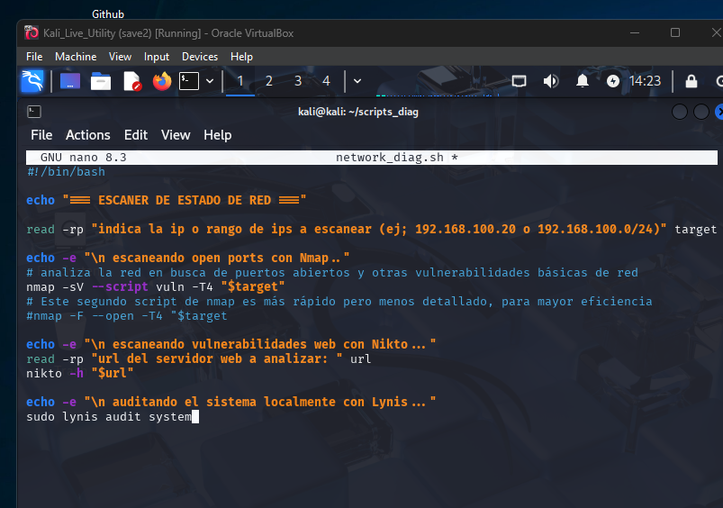

*Código del script de bash*

```bash
#!/bin/bash
echo "== ESCANER DE ESTADO DE RED =="

read -rp "indica la ip o rango de ips a escanear (ej; 192.168.100.20 o 192.168.100.0/24): " target

echo -e "\n📡 escaneando open ports con Nmap..."
# analiza la red en busca de puertos abiertos y otras vulnerabilidades básicas de red
nmap -sV --script vuln -T4 "$target"
# Este segundo script de nmap es más rápido pero menos detallado, para mayor eficiencia
# nmap -F --open -T4 "$target"

echo -e "\n🕷️ escaneando vulnerabilidades web con Nikto..."
read -rp "url del servidor web a analizar: " url
nikto -h "$url"

echo -e "\n🔍 auditando el sistema localmente con Lynis..."
sudo lynis audit system
```

---

## **Ejecución de los scripts de diagnóstico**

- Una vez tenemos un toolkit básico con scripts en bash para auditar un equipo, pasaremos a ejecutarlo uno por uno en un equipo de pruebas para comprobar los resultados que nos da:
  
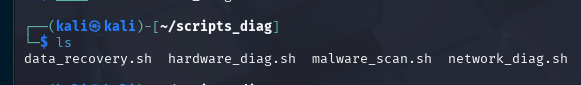

## **Pasos Previos Comunes**

*Para ejecutar los scripts que hemos creado para automatizar el proceso de diagnóstico y verificación del equipo*

1. **Arranca el sistema Live que hayas elegido** (desde la ISO en la VM).
2. Abre el terminal.
3. Ve a tu carpeta de scripts:
4. Comprueba que la carpeta de scripts tiene permiso de ejecución
```cmd
sudo chmod +x *.sh
```

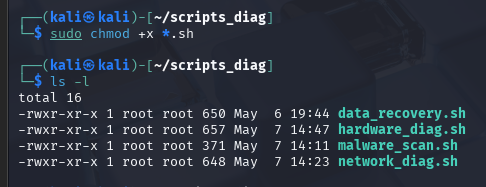

*Si estás en un entorno sin persistencia, tendrás que copiar los scripts desde un USB, red o volver a crearlos en cada sesión.*

- Ejecutamos el primer script para diagnóstico de hardware general del equipo, de este script debemos esperar los siguientes resultados:

```cmd
./hardware_diag.sh
```

- Información sobre RAM (`free -h`)
- Información del disco y estado SMART (`lsblk`, `smartctl`)
- Información de CPU (`lscpu`)
- Resumen de hardware (`lshw -short`)

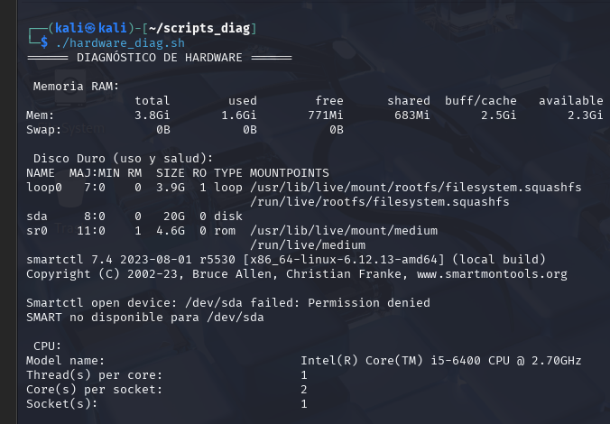


- Comprobamos que el script de recuperación de datos funciona correctamente:

```cmd
./data_recovery.sh
```

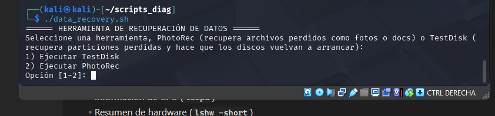

- Si seleccionamos cualquiera de las opciones de recuperación de datos accedemos al menú interactivo de la herramienta que hayamos elegido

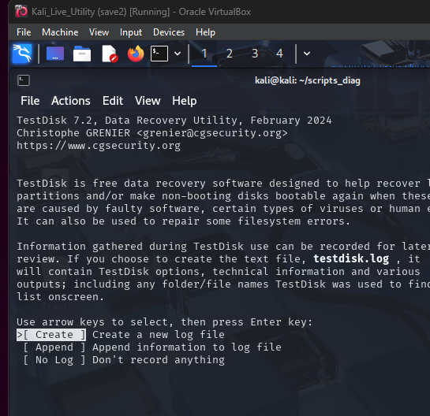

- Si seleccionamos la herramienta PhotoRec nos aparecerán los dispositivos detectados:

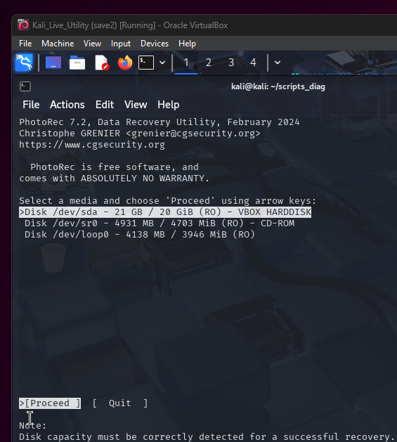


```cmd
./malware_scan.sh
```

- Análisis con `chkrootkit`, `rkhunter`, y `clamscan`, esperamos a que finalicen los análisis ya que puede tardar bastante
    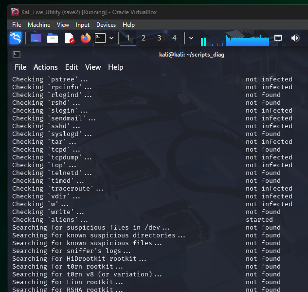

- Aquí comprobamos algunas advertencias y comprobaciones detectadas en cierto files que deberíamos investigar más a fondo

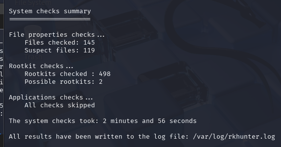


- Pide que ingreses una ruta a escanear o incluso puedes editar el path o ruta desde el propio script con un editor como nano (ej. `/mnt/sda1`)

*ClamAV escaneando la ruta que le hemos indicado, junto a los resultados obtenidos*

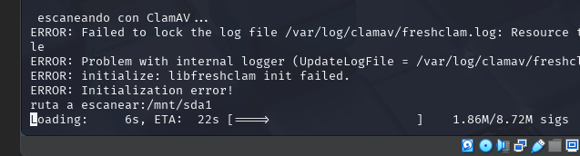


```cmd
./network_diag.sh
```

> Asegúrate de estar conectado en modo "Bridged" o "NAT con acceso a LAN" a la hora de testear máquinas virtuales.

- Recomendable ejecutar en otro terminal el escáner de red, ya que pese a que he configurado los scripts de nmap para que sean rápidos, pueden tardar bastante algunas veces dependiendo de la red o rango a analizar, si tardara demasiado puedes usar el otro script comentado.

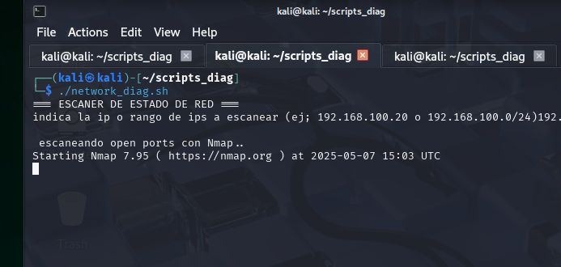

- Pide una IP o red a escanear (ej;`192.168.100.0/24`)
- Lanza escaneo con `nmap`
- Luego pide una URL para `nikto` (puedes omitir esto, yo lo hice por comprobar una webapp simple para testear)
- Termina con auditoría local de `lynis`
